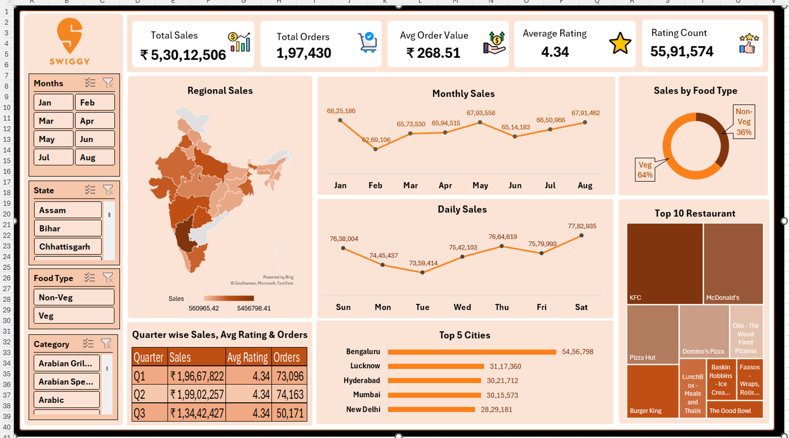

# 📊 Swiggy Sales Dashboard (Microsoft Excel)

## 📌 Project Overview
This project is an interactive Excel dashboard designed to analyze Swiggy sales performance. It provides valuable insights into sales trends, customer ratings, restaurant performance, and regional sales distribution.

## 🎯 Objectives
- Analyze total sales and orders.
- Monitor monthly and daily sales trends.
- Compare Veg and Non-Veg sales performance.
- Identify top-performing restaurants and cities.
- Track customer ratings and order patterns.

## 📊 Dashboard Features
- Total Sales Analysis
- Total Orders Tracking
- Average Order Value (AOV)
- Average Rating Analysis
- Regional Sales Map
- Monthly Sales Trend
- Daily Sales Trend
- Food Type Distribution
- Top 10 Restaurants
- Top 5 Cities
- Quarter-wise Performance Summary
- Interactive Slicers for filtering data

## 🛠️ Tools Used
- Microsoft Excel
- Pivot Tables
- Pivot Charts
- Slicers
- Conditional Formatting
- Data Cleaning

## 📷 Dashboard Preview

## 💡 Key Insights
- Bengaluru recorded the highest sales.
- Veg food contributed 64% of total sales.
- KFC emerged as the top-performing restaurant.
- Weekend sales were generally higher than weekdays.

## 📂 Files Included
- Swiggy_Sales_Dashboard.xlsx
- dashboard-preview.png
- README.md

## 👨‍💻 Author
**Gulam Qadir Siddiqui**

### Skills
- Advanced Excel
- Data Cleaning
- Dashboard Development
- Pivot Tables & Charts
- Data Analysis

---
⭐ If you found this project useful, please give it a star!
